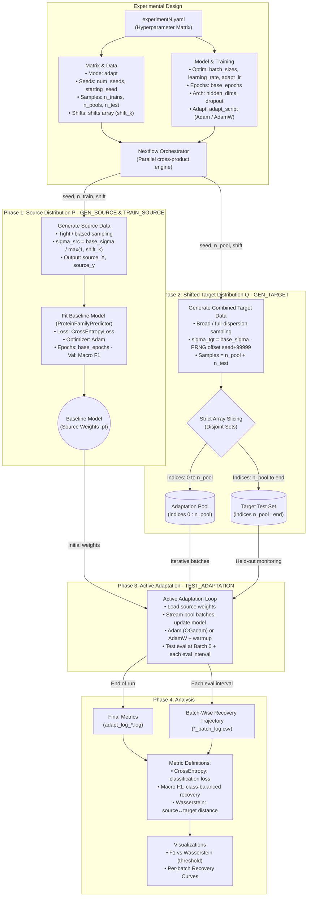

# Identifying the Recovery Threshold for Protein Language Models under Data Distribution Shift

> Master's Thesis — synthetic-data framework for measuring how, and *when*, a predictive model fine-tuned on Protein Language Model (PLM) embeddings can recover performance after the data distribution shifts beneath it.

This repository contains the full experimental apparatus: a controllable synthetic protein universe, a frozen ground-truth labeler, a distributed training/adaptation pipeline, and the analysis code used to locate the **recovery threshold** — the point of distribution shift past which active adaptation can no longer restore the model.

---

## Table of Contents

1. [Motivation](#motivation)
2. [Core Methodology](#core-methodology)
   - [The Frozen Oracle](#1-the-frozen-oracle-ground-truth-labeling)
   - [GMM Embedding Universe](#2-the-gmm-embedding-universe)
   - [Simulating Covariate Shift](#3-simulating-evolutionary-covariate-shift)
   - [Metrics](#4-metrics)
3. [The Two Workflows](#the-two-workflows)
   - [Phase 1 — Oracle Grid Search](#phase-1--oracle-grid-search-srcoracle_search)
   - [Phase 2 — Main Adaptation Pipeline](#phase-2--main-adaptation-pipeline-mainnf)
4. [Repository Structure](#repository-structure)
5. [Environment Setup](#environment-setup)
6. [Reproducing the Experiments](#reproducing-the-experiments)
7. [Configuration Reference](#configuration-reference)
8. [Outputs & Analysis](#outputs--analysis)
9. [Pipeline Architecture Diagram](#pipeline-architecture-diagram)

---

## Motivation

Protein Language Models (e.g. ESM-2) produce high-dimensional embeddings (1280-D) that downstream predictors use to assign functional or taxonomic labels. In the real world, the protein distribution a model is trained on (its **source** distribution `P`) drifts away from the distribution it is later asked to predict (its **target** distribution `Q`) — through evolutionary divergence, sampling bias, or newly discovered families. This is **covariate shift**.

This thesis asks a sharp, quantitative question:

> Given a model trained on a source distribution, **how far can the target distribution drift before active adaptation on new data can no longer recover the lost performance?**

Because real protein data offers no ground-truth control over the *magnitude* of shift, we build a fully synthetic — but biologically motivated — universe in which shift is a single tunable scalar. This lets us sweep shift continuously and map the recovery threshold precisely.

---

## Core Methodology

The central idea is to replace a real PLM + real labels with a **controllable simulator** that preserves the key statistical structure (clustered families, label boundaries, a covariate-shift axis) while making every variable reproducible and dial-able.

### 1. The Frozen Oracle (Ground-Truth Labeling)

A **`RandomOracleNN`** (defined in `src/generate_simulation.py`) is a randomly-initialized, **never-trained** neural network that maps a 1280-D embedding to one of `n_classes` taxonomic labels via `argmax` over its output logits.

- It is seeded deterministically, so the *same* oracle defines the labeling function for both source and target data within a run.
- Its weights are frozen (Kaiming-initialized hidden layers, L2-normalized final layer, LayerNorm + ReLU between layers).
- It plays the role of "ground-truth biology": a fixed, complex, non-linear decision surface over embedding space.

Because the oracle is fixed, the label of any point in 1280-D space is determined purely by *where* the point lands — which is exactly what lets us inject covariate shift cleanly.

### 2. The GMM Embedding Universe

Embeddings are drawn from a high-dimensional **Gaussian Mixture Model** representing a synthetic protein landscape:

- **`n_families`** cluster centroids are scattered through 1280-D space (default `gaussian` topology; `hypercube`, `hypersphere`, and `projection` topologies are also implemented).
- Family membership is sampled from a **Zipf distribution** (`rank^-1.5`), reproducing the heavy-tailed family-size imbalance seen in real protein databases (a few huge families, a long tail of rare ones).
- Each sample is `centroid + Gaussian noise`, where the noise scale `σ` (`base_sigma`) controls within-family dispersion.
- The frozen Oracle then labels every sampled point.

The landscape is validated by three diagnostics (printed during source generation):

| Diagnostic | Meaning | Target Range |
|---|---|---|
| **Within-family purity** | fraction of a family sharing its majority label | 50–70% |
| **Family promiscuity** | fraction of families spanning >1 label | 40–60% |
| **Class coverage** | average families per class | ~10 |

These targets are what **Phase 1 (the oracle grid search)** exists to satisfy.

### 3. Simulating Evolutionary Covariate Shift

Shift is injected through the **dispersion** of the source vs. target distributions, controlled by the scalar `shift_k`:

- **Source** data is sampled *tightly* around centroids: `σ_source = base_sigma / max(1, shift_k)`. The model trains on a narrow, biased view of each family.
- **Target** data is sampled at full dispersion: `σ_target = base_sigma`. The target pool and test set explore the *broad*, true extent of each family — including regions the source model never saw.
- The target PRNG is offset (`seed + 99999`) so target points are genuinely **new draws** from the *same* GMM universe, never copies of source points.

A larger `shift_k` ⇒ a narrower, more biased source ⇒ a larger gap between what the model learned and the true target distribution ⇒ more covariate shift to recover from. The empirical magnitude of this gap is measured with the **Wasserstein distance** between source and target features.

### 4. Metrics

Defined in `src/metrics.py` and logged throughout adaptation:

- **Cross-Entropy (CE) Loss** — primary training/evaluation objective (`CrossEntropyLoss`).
- **Macro F1** — class-balanced recovery metric; treats every taxonomic class equally regardless of Zipf imbalance.
- **Feature Wasserstein Distance** — average per-feature 1-D Wasserstein distance between source and target embeddings; the empirical x-axis against which the recovery threshold is plotted.

---

## The Two Workflows

The project is split into two clearly separated phases. **Phase 1 calibrates the simulator; Phase 2 runs the science.**

### Phase 1 — Oracle Grid Search (`src/oracle_search/`)

**Goal:** find the `(oracle architecture, base_sigma)` combination that produces a biologically realistic landscape — i.e. one that hits the purity / promiscuity / coverage targets above. This is a *calibration* step, run once, and is **fully decoupled from the main pipeline**.

| File | Role |
|---|---|
| `run_tuner.sh` | SLURM **array** launcher (`--array=0-23`) — fans the 24-cell grid across array tasks |
| `tune_landscape_array.py` | Array worker: maps `$SLURM_ARRAY_TASK_ID` → one `(architecture, sigma)` cell, invokes the simulator, scrapes the diagnostics, writes `tuning_result_<id>.csv` |
| `run_massive_grid.py` | Standalone multiprocessing sweep over `(seed, shift, n_pool, sigma, ratio)` computing source↔target Wasserstein distances at scale |
| `generate_simulation.py` | Self-contained copy of the simulator used **only** by `run_massive_grid.py` (co-located so its `from generate_simulation import …` / `from metrics import …` imports resolve locally) |
| `metrics.py` | Self-contained metrics copy for the same standalone sweep |

The grid swept by `tune_landscape_array.py`:

```python
architectures = ["512,256", "1024,512", "2048,1024", "1024,1024,512"]
sigmas        = [0.1, 0.3, 0.5, 0.7, 1.0, 1.4]   # 4 × 6 = 24 cells
```

> **Note:** `tune_landscape_array.py` shells out to the **canonical** `src/generate_simulation.py` (invoked from the project root), so it exercises the exact same simulator the main pipeline uses. The chosen winner from this phase — `oracle: "1024,1024,512"`, `base_sigma: 0.5` — is what you'll see hard-coded into the Phase 2 configs.

### Phase 2 — Main Adaptation Pipeline (`main.nf`)

**Goal:** for each point in a large hyperparameter grid, train a source model, generate shifted target data, run an active-adaptation loop, and log the recovery trajectory. This is a **Nextflow** DAG that fans a combinatorial sweep across SLURM (the Sapelo2 HPC cluster).

The DAG has four processes:

| Nextflow Process | Script Called | Hardware | What it does |
|---|---|---|---|
| `GEN_SOURCE` | `src/generate_simulation.py --mode source` | CPU (32 GB) | Build the GMM universe + frozen oracle; emit tight (biased) source embeddings + labels |
| `TRAIN_SOURCE` | `src/train.py` | GPU (A100) | Train `ProteinFamilyPredictor` (CE + Adam) on source; emit `.pt` weights |
| `GEN_TARGET` | `src/generate_simulation.py --mode target` | CPU (32 GB) | Draw broad target data; slice into a disjoint **adaptation pool** and **test set** |
| `TEST_ADAPTATION` | `src/${adapt_script}` | GPU (A100) | Load source model; stream pool batches, update weights, re-evaluate on the held-out test set after each eval interval; log the recovery curve |

The adaptation optimizer is **swappable per experiment** via the `adapt_script` config field:

- `adapt_OGadam.py` — vanilla **Adam** (`lr = 1e-3`)
- `adapt_adamw.py` — **AdamW** + warmup LR scheduler + weight decay (`lr = 5e-5`)

The predictive model itself (`src/model.py`) is a 3-layer MLP: `1280 → hidden_dim → hidden_dim/2 → n_classes`, with BatchNorm, ReLU, and dropout.

---

## Repository Structure

```
PLM_GMM_Thesis_Archive/
├── main.nf                       # Phase 2 orchestrator (Nextflow DAG)
├── nextflow.config               # Executor profiles: `standard` (local) & `sapelo2` (SLURM)
├── run_experiments.sh            # Generic master launcher (params-file driven)
├── run_exp1.sh … run_exp5.sh     # Per-experiment SLURM launchers (isolated work-dirs/logs)
│
├── configs/
│   ├── master.yaml               # Annotated reference config (documents every knob)
│   └── experiment{1..5}.yaml     # The five thesis experiments (see matrix below)
│
├── src/                          # Active pipeline code (everything main.nf invokes)
│   ├── generate_simulation.py    # Frozen Oracle + GMM simulator (source/target modes)
│   ├── model.py                  # ProteinFamilyPredictor (MLP)
│   ├── train.py                  # Source-domain training (Phase 2, TRAIN_SOURCE)
│   ├── adapt.py                  # Adaptation loop — baseline reference
│   ├── adapt_OGadam.py           # Adaptation loop — vanilla Adam (Exp 1, 3)
│   ├── adapt_adamw.py            # Adaptation loop — AdamW + warmup (Exp 2, 4, 5)
│   ├── metrics.py                # Macro F1 + feature Wasserstein
│   └── oracle_search/            # ── PHASE 1: oracle calibration (decoupled) ──
│       ├── run_tuner.sh
│       ├── tune_landscape_array.py
│       ├── run_massive_grid.py
│       ├── generate_simulation.py
│       └── metrics.py
│
├── archive/                      # Inactive analysis/plotting/diagnostics (not on any path)
│   ├── *.py                      # compile_*, plot_*, verify_*, diagnostics, etc.
│   └── src/                      # archived former-src visualizers & eval
│
├── requirements.txt              # Pinned Python environment
├── Dockerfile                    # Containerized PyTorch+CUDA environment
└── README.md
```

> `archive/` holds exploratory compilation, plotting, and diagnostic scripts that are **not** invoked by `main.nf` or the oracle search. They are preserved for provenance but are off the execution path.

---

## Environment Setup

The pipeline requires **Python 3.11+**, **PyTorch (CUDA)**, and **Nextflow** (for Phase 2). Pick one of the following.

### Option A — Conda (recommended; matches the HPC environment)

```bash
# Create and activate an environment
conda create -n plm_dynamics python=3.11 -y
conda activate plm_dynamics

# Install pinned dependencies
pip install -r requirements.txt

# Install Nextflow (Phase 2 only) — requires Java 11+
curl -s https://get.nextflow.io | bash
sudo mv nextflow /usr/local/bin/   # or add to PATH
```

### Option B — Docker / Apptainer (reproducible container)

```bash
docker build -t plm-thesis:1.0 .
# Run interactively:
docker run --gpus all -it -v "$PWD":/app plm-thesis:1.0 bash
```

The image is built on `pytorch/pytorch:2.1.0-cuda12.1-cudnn8-runtime` and installs `requirements.txt`. On HPC, convert to Apptainer/Singularity as your site requires.

### Option C — Sapelo2 HPC (UGA cluster — as used for the thesis)

The provided SLURM scripts load the cluster modules and activate a pre-built conda env. They expect:

```bash
module load Miniforge3
module load Nextflow
source activate /work/ah2lab/LiamK/conda_envs/plm_dynamics
```

> **Important:** the `configs/experiment*.yaml` files write to absolute cluster paths
> (`data_dir: /scratch/...`, `metrics_dir: /work/...`). **Edit these to valid paths on your
> system before running**, or override them on the command line with `--data_dir` / `--metrics_dir`.

---

## Reproducing the Experiments

### Step 0 — Sanity-check the simulator (any machine, no GPU needed)

Generate a small source landscape and inspect the diagnostics:

```bash
cd PLM_GMM_Thesis_Archive
python src/generate_simulation.py \
    --mode source --n_train 20000 \
    --n_families 1000 --n_classes 100 \
    --oracle_layers "1024,512" --base_sigma 0.5 --seed 42
```

You should see the **Landscape Diagnostics** block (purity / promiscuity / coverage) and a saved
`landscape_diagnostic_seed_42.png`.

### Step 1 — Phase 1: Calibrate the Oracle

**On SLURM** (runs all 24 grid cells as an array, then auto-merges):

```bash
# With an explicit run name — results land in full_grid_results_baseline.csv
bash submit_oracle_search.sh baseline

# Without a run name — a timestamp suffix is generated automatically
bash submit_oracle_search.sh
# → results/oracle_search/full_grid_results_20260604_143021.csv
```

`submit_oracle_search.sh` creates the required output and log directories, submits the 24-task
SLURM array, and chains a lightweight merge job that concatenates the per-cell CSVs into a single
`results/oracle_search/full_grid_results_<suffix>.csv` once every array task succeeds. The raw
per-cell CSVs are deleted automatically after the merge. Using a distinct run name (or the
auto-generated timestamp) for each submission prevents results from being overwritten.

**Locally** (run a single grid cell by its task index, 0–23):

```bash
python src/oracle_search/tune_landscape_array.py 14
```

Inspect the per-cell CSVs in `results/oracle_search/raw_csvs/` and pick the `(oracle, sigma)`
whose diagnostics sit inside the target ranges. (The thesis selection — `"1024,1024,512"` @
`sigma=0.5` — is already baked into the Phase 2 configs, so you can skip straight to Step 2 to
reproduce the published runs.)

*Optional* large-scale Wasserstein characterization:

```bash
sbatch src/oracle_search/run_massive_grid.py   # via a SLURM wrapper, or run directly with python
```

### Step 2 — Phase 2: Run the Main Pipeline

**On SLURM (Sapelo2)** — each experiment has an isolated launcher with its own work-dir and log:

```bash
sbatch run_exp1.sh     # Adam baseline,  arch/training sweep
sbatch run_exp2.sh     # AdamW baseline, arch/training sweep
sbatch run_exp3.sh     # High-resolution shift sweep (Adam)
sbatch run_exp4.sh     # Train-size sweep (AdamW)
sbatch run_exp5.sh     # Base-sigma sweep (AdamW)
```

Each script runs, under the hood:

```bash
nextflow -log nextflow_expN.log run main.nf \
    -profile sapelo2 \
    -params-file configs/experimentN.yaml \
    -work-dir work_expN
```

**Locally / single node** (use the `standard` profile, which executes processes on the local machine):

```bash
nextflow run main.nf \
    -profile standard \
    -params-file configs/experiment1.yaml \
    -resume
```

> `-resume` reuses cached process results, so re-running after a failure or a config tweak only
> recomputes what changed. The per-experiment scripts use distinct `-work-dir`s so concurrent
> experiments never collide in the Nextflow cache.

### Step 3 — Analyze

Outputs land under `<metrics_dir>/<dataset>/experiments/adapt/` as `adapt_log_*.log` (final
metrics + Wasserstein) and `*_batch_log.csv` (the full per-batch recovery trajectory). The
compilation and plotting scripts used to turn these into thesis figures are preserved in
`archive/` (e.g. `compile_all_exps.py`, `plot_wasserstein.py`).

---

## Configuration Reference

Every run is fully described by a single YAML in `configs/`. Nextflow forms the **Cartesian
product** of all array-valued fields, so the number of pipeline runs = the product of the array
lengths. `configs/master.yaml` documents every field; the key knobs:

| Field | Meaning |
|---|---|
| `mode` | `adapt` (active-learning recovery) — the routing for `main.nf` |
| `dataset` | output namespace (root directory name for data/models/results) |
| `data_dir` / `metrics_dir` | **absolute** output locations (edit for your system) |
| `n_families`, `n_classes`, `dim` | landscape size (dim = 1280, ESM-2 embedding width) |
| `oracle_architectures` | hidden-layer spec(s) for the Frozen Oracle |
| `base_sigmas` | within-family dispersion σ |
| `starting_seed`, `num_seeds` | reproducibility seeds (runs `seed … seed+num_seeds-1`) |
| `n_trains` | source training set sizes |
| `n_pools` | target adaptation-pool sizes |
| `shifts` | covariate-shift multipliers `shift_k` (1.0 = no shift) |
| `n_test` | held-out disjoint target test-set size |
| `batch_sizes`, `hidden_dims` | MLP sweep axes |
| `adapt_script` | which adaptation optimizer to use (`adapt_OGadam.py` / `adapt_adamw.py`) |
| `adapt_lr`, `base_epochs`, `learning_rate`, `dropout` | training/adaptation hyperparameters |

### The Five Thesis Experiments

| Exp | Optimizer (`adapt_script`) | Primary Sweep | Seeds | n_train | n_pool | shifts | batch / hidden |
|----|---------------------------|---------------|:----:|---------|--------|--------|----------------|
| **1** | Adam (`adapt_OGadam`) | architecture × pool | 3 | 1 M | 100k, 500k | 1, 2, 5 | {64,256} × {512,1024} |
| **2** | AdamW (`adapt_adamw`) | architecture × pool | 3 | 1 M | 100k, 500k | 1, 2, 5 | {64,256} × {512,1024} |
| **3** | Adam (`adapt_OGadam`) | high-res shift | 4 | 250k | 1 M | 2,3,4,5,6 | 256 × 1024 |
| **4** | AdamW (`adapt_adamw`) | training-set size | 4 | 50k–500k | 1 M | 2,3,4,5,6 | 256 × 512 |
| **5** | AdamW (`adapt_adamw`) | dispersion σ | 3 | 500k | 1 M | 1,3,5 | 256 × 512 |

All five fix the calibrated oracle (`"1024,1024,512"`). Experiments 3–6 widen the pool to 1 M to
eliminate the "data-starvation" confound and sample the shift axis densely to resolve the
threshold.

---

## Outputs & Analysis

For every grid cell, `TEST_ADAPTATION` emits:

- **`adapt_log_S{seed}_N{ntrain}_NP{npool}_Shf{shift}_B{batch}_H{hdim}.log`** — human-readable
  log ending with the final Wasserstein distance, test CE, and test Macro F1.
- **`*_batch_log.csv`** — the recovery trajectory: `batch_number, samples_seen, train_loss,
  test_ce, test_f1`, one row per evaluation interval (including the pre-adaptation **Batch 0**
  baseline).

The recovery threshold is read off by plotting **final test Macro F1 vs. source↔target Wasserstein
distance**: performance holds as shift grows, then collapses past a critical distance — the
threshold this thesis sets out to identify.

---

## Pipeline Architecture Diagram



---

## Citation

If you use this framework, please cite the thesis:

> Liam Kozma. *Identifying the Recovery Threshold for Protein Language Models under Data
> Distribution Shift.* Master of Science in Statistics Thesis, University of Georgia, 2026.
> Advisor: Dr. Adrienne Hoarfrost.

*Compute provided by the University of Georgia GACRC Sapelo2 cluster.*
