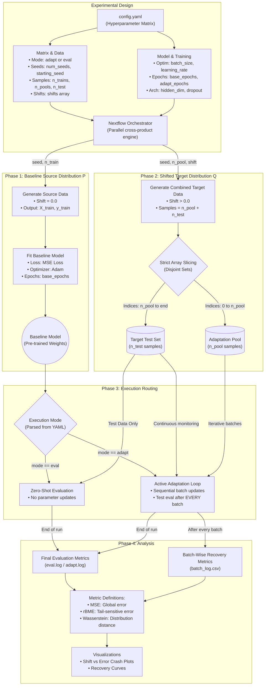

```mermaid
graph TD
    subgraph Config [Experimental Design]
        CONFIG_ROOT["config.yaml<br/>(Hyperparameter Matrix)"]
        
        CONFIG_DATA["Matrix & Data<br/>• Mode: adapt or eval<br/>• Seeds: num_seeds, starting_seed<br/>• Samples: n_trains, n_pools, n_test<br/>• Shifts: shifts array"] 
        CONFIG_MODEL["Model & Training<br/>• Optim: batch_size, learning_rate<br/>• Epochs: base_epochs, adapt_epochs<br/>• Arch: hidden_dim, dropout"]
        
        ORCH["Nextflow Orchestrator<br/>(Parallel cross-product engine)"]
        
        CONFIG_ROOT --> CONFIG_DATA
        CONFIG_ROOT --> CONFIG_MODEL
        
        CONFIG_DATA --> ORCH
        CONFIG_MODEL --> ORCH
    end

    subgraph Phase1 [Phase 1: Baseline Source Distribution P]
        GEN_SRC["Generate Source Data<br/>• Shift = 0.0<br/>• Output: X_train, y_train"]
        TRAIN["Fit Baseline Model<br/>• Loss: MSE Loss<br/>• Optimizer: Adam<br/>• Epochs: base_epochs"]
        BASE_MODEL(("Baseline Model<br/>(Pre-trained Weights)"))
        
        ORCH -->|seed, n_train| GEN_SRC
        GEN_SRC --> TRAIN
        TRAIN --> BASE_MODEL
    end

    subgraph Phase2 [Phase 2: Shifted Target Distribution Q]
        GEN_TGT["Generate Combined Target Data<br/>• Shift > 0.0<br/>• Samples = n_pool + n_test"]
        SPLIT{"Strict Array Slicing<br/>(Disjoint Sets)"}
        TGT_TEST[("Target Test Set<br/>(n_test samples)")]
        TGT_POOL[("Adaptation Pool<br/>(n_pool samples)")]
        
        ORCH -->|seed, n_pool, shift| GEN_TGT
        GEN_TGT --> SPLIT
        SPLIT -->|Indices: n_pool to end| TGT_TEST
        SPLIT -->|Indices: 0 to n_pool| TGT_POOL
    end

    subgraph Phase3 [Phase 3: Execution Routing]
        ROUTER{"Execution Mode<br/>(Parsed from YAML)"}
        EVAL["Zero-Shot Evaluation<br/>• No parameter updates"]
        ADAPT["Active Adaptation Loop<br/>• Sequential batch updates<br/>• Test eval after EVERY batch"]
        
        BASE_MODEL --> ROUTER
        
        %% Lengthened arrows here to prevent text overlap
        ROUTER -->|mode == eval| EVAL
        TGT_TEST --->|Test Data Only| EVAL
        
        ROUTER -->|mode == adapt| ADAPT
        TGT_TEST --->|Continuous monitoring| ADAPT
        TGT_POOL --->|Iterative batches| ADAPT
    end

    subgraph Phase4 [Phase 4: Analysis]
        RES_FINAL["Final Evaluation Metrics<br/>(eval.log / adapt.log)"]
        RES_BATCH["Batch-Wise Recovery Metrics<br/>(batch_log.csv)"]
        METRICS["Metric Definitions:<br/>• MSE: Global error<br/>• rBME: Tail-sensitive error<br/>• Wasserstein: Distribution distance"]
        PLOTS["Visualizations<br/>• Shift vs Error Crash Plots<br/>• Recovery Curves"]
        
        EVAL -->|End of run| RES_FINAL
        ADAPT -->|End of run| RES_FINAL
        ADAPT -->|After every batch| RES_BATCH
        
        RES_FINAL --> METRICS
        RES_BATCH --> METRICS
        METRICS --> PLOTS
    end
```

