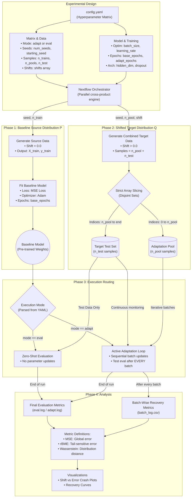

# Recovery Threshold for Protein Language Models under Data Distribution Shift

**Author:** Liam Kozma  
**Program:** Master of Science in Statistics, University of Georgia  

## Overview

This repository contains the experimental pipeline and PyTorch codebase investigating the non-linear learning dynamics of Protein Language Models (PLMs) from the perspective of statistical learning theory. While models like the ESM series or ProtBERT are trained on biological sequences, they function mathematically as high-dimensional inference engines where statistical patterns of amino acid co-occurrence encode the biophysical laws of folding.

The objective of this project is to formally identify the **Recovery Threshold** ($n_B$): the critical ratio of out-of-distribution (OOD) target data required to minimize target empirical risk, overcome negative transfer, and trigger model realignment to a target distribution under strict covariate shift in high-dimensional space.

## Theoretical Framework

### High-Dimensional Statistical Inference
PLMs embed biological sequences into a vast ambient space $\mathbb{R}^D$, where $D$ is typically large ($D \approx 1024$ or $1280$). In such high-dimensional regimes, the geometry of the data distribution is subject to the curse of dimensionality—volume scales exponentially, and distance metrics behave counterintuitively. We are modeling the adaptation dynamics directly within this unstructured $\mathbb{R}^D$ space to understand the baseline sample complexity required to learn a shifted non-linear fitness landscape.

### Covariate Shift & Negative Transfer
The primary statistical challenge in deploying PLMs is data distribution shift. We define the source domain as $P_S(X, Y)$ and the target domain as $P_T(X, Y)$. We are specifically modeling **covariate shift**, where the marginal distributions of the embeddings diverge ($P_S(X) \neq P_T(X)$) while the conditional fitness landscape remains invariant ($P_S(Y|X) = P_T(Y|X)$). 

In biological applications (e.g., adapting from evolutionary data to engineered sequences), this shift can be severe. If a model trained via Empirical Risk Minimization (ERM) on $P_S$ is naively fine-tuned on a small sample from $P_T$, it often suffers from **negative transfer**. The gradient updates from the sparse OOD target batch disrupt the pre-learned high-dimensional weights before sufficient target density can establish the new optimal parameters.

## Research Phases

### Phase 1: Controlled Statistical Simulation (Current Codebase)
To strictly control the shift parameter ($\lambda$) and study the high-dimensional dynamics, we simulate the data generating process (DGP):
1.  **Source Distribution:** Generate high-dimensional features $X_S \sim \mathcal{N}(0, I_D)$.
2.  **Covariate Shift:** Induce a shift vector $\mathbf{v}$ (where $\|\mathbf{v}\|_2 = 1$) scaled by magnitude $\lambda$ and $\sqrt{D}$, such that the target space is $X_T = X_S + \lambda \sqrt{D} \mathbf{v}$.
3.  **Fitness Function (The Peak):** The response variable $Y$ is defined by a non-linear quadratic landscape mapped by a sigmoid function to bound fitness $Y \in [0, 1]$:
    $$Y = \sigma\left(X^T w - \frac{1}{2D} \|X\|_2^2 + c\right)$$
    (where $w \sim \mathcal{N}(0, I_D / D)$). As $\lambda$ increases, the population shifts away from the high-density fitness peak, severely testing the model's out-of-distribution extrapolation.

### Phase 2: Empirical Application (Future Work)
We will map these simulation findings to real-world protein data by estimating the distribution shift between curated protein databases (e.g., SessProt) and noisy metagenomic data (e.g., OM-RGC). Using the sample complexity bounds derived in Phase 1, we will estimate the exact $n_B$ required to successfully adapt a PLM to these real-world contexts.

## Evaluation: Tail-Sensitive Metrics

Under severe covariate shift, the standard Mean Squared Error ($\frac{1}{n}\sum(\hat{y}_i - y_i)^2$) is a biased estimator of true functional utility. Because high-fitness variants are exceedingly rare in the tails of the distribution ($P(Y > \tau) \to 0$), MSE is heavily dominated by the high-density "dead" zones ($Y \approx 0$).

To correct this, we implement the **Relative Bin-Mean Error (rBME)**. By partitioning the support of $Y$ into $K$ bins, rBME equalizes the weight of each fitness strata:
$$rBME = \frac{1}{K} \sum_{k=1}^K \frac{\mathbb{E}_{X \in B_k}[|Y - \hat{Y}|]}{\mathbb{E}_{X \in B_k}[|Y|] + \epsilon}$$
This statistically penalizes models that collapse to predicting the mean and forces the preservation of tail-end accuracy (the "outliers" that represent valuable biological variants).

## Future Extensions: The Manifold Hypothesis

While this thesis strictly analyzes adaptation in the unstructured ambient space $\mathbb{R}^D$, future work may investigate these dynamics under the **Manifold Hypothesis**. Biological sequences likely do not fill $\mathbb{R}^D$ uniformly but are constrained to a low-dimensional topological manifold $\mathcal{M} \subset \mathbb{R}^D$ with intrinsic dimension $d \ll D$. We theorize that if data is generated on a linear subspace (e.g., $X = ZQ^T$ where $Z \in \mathbb{R}^d$), the sample complexity required to overcome negative transfer will be fundamentally altered. Investigating the divergence in adaptation behavior between $\mathbb{R}^D$ and $\mathcal{M}$ represents a compelling avenue for subsequent research.

## Repository Structure & Usage

* `generate_simulation.py`: The DGP engine for creating High-Dimensional ($\mathbb{R}^D$) datasets.
* `model.py`: Implements `FitnessPredictor`, a feed-forward neural network representing the inference function $f: \mathbb{R}^D \mapsto [0, 1]$.
* `train.py` & `eval.py`: PyTorch training and inference scripts.
* `metrics.py`: Implements the `calculate_rbme` scoring function.
* `main.nf`: The Nextflow orchestrator automating the active learning loop, applying distribution shifts ($\lambda \in [0.5, 1.0, 1.5, 2.0, 3.0]$), and managing adaptation/generalization tests.
* `view_results.py`: Parses the logs and visualizes the model failure point (The "Crash") by plotting MSE vs. rBME across varying shift magnitudes.

### Execution

**Requirements:**
Install the Python dependencies. Note: It is highly recommended to set up and activate a virtual environment before running the installation to avoid system-wide package conflicts.
```bash
python -m venv venv
source venv/bin/activate
pip install -r requirements.txt
```

**Running Locally (Nextflow Pipeline):**
The `main.nf` script acts as the orchestrator for the entire statistical simulation and active learning loop.
```bash
nextflow run main.nf --mode adapt --data highdim
```
When you execute this command, the pipeline performs the following sequence:
1. **Source Generation:** Runs the `GEN_SOURCE` process to create a baseline dataset with zero shift.
2. **Baseline Training:** Triggers the `TRAIN_SOURCE` process, which feeds the zero-shift data into `train.py` to establish the baseline neural network weights.
3. **Target Generation:** The `GEN_TARGET` process simultaneously creates five distinct out-of-distribution (OOD) target datasets corresponding to shift magnitudes (λ) of 0.5, 1.0, 1.5, 2.0, and 3.0.
4. **Evaluation/Adaptation:** Depending on the flags provided, it routes the generated targets to either be evaluated against the baseline model or to be used for adapting the model.

## Nextflow Tags (`main.nf`):

* `--mode`: Controls the experimental pathway
    * `adapt` (default): Triggers the `TEST_ADAPTATION` process. This runs `train.py` on the shifted target datasets, attempting to fine-tune the model to overcome negative transfer.
    * `eval`: Triggers the `TEST_GENERALIZATION` process. This runs `eval.py` to test how the pre-trained baseline model performs on the OOD target data without any gradient updates.
* ``--data``: Defines the geometry of the data generating process.
    * `highdim`: Routes to `generate_highdim_data`, simulating covariate shift directly in the unstructured ambient space RD.
    * `manifold`: Routes to `generate_manifold_data`, constraining the simulated sequences to a lower-dimensional topological subspace before applying the shift.

## Generating Statistical Plots:

After Nextflow finishes its parallel execution, use this script to parse the distributed `.log` files and visualize the model's failure point (the "Crash").
```
python src/view_results.py --data highdim
```
This extracts the standard Mean Squared Error (MSE) and the custom Relative Bin-Mean Error (rBME) from either the final training epoch or the evaluation output, generating a dual-axis plot comparing these metrics against the distribution shift magnitude.

**Plotting Flags (`view_results.py`):**

* `--data`: Accepts `manifold`, `highdim`, or `old`. It dynamically sets the directory path (`results/{args.data}/experiments`) to aggregate and plot the correct batch of Nextflow logs.

## Under-the-Hood Script Flags

While Nextflow automates the pipeline, it relies on passing the following arguments to the underlying Python scripts:

`generate_simulation.py`
* `--type`: Selects the data geometry (`manifold` or `highdim`).
* `--shift`: A float representing the magnitude of the shift vector applied to the data.
* `--n_samples`: An integer (defaulting to 1000) that controls the size of the generated dataset.
* `--output_x` & `--output_y`: Destination filepaths for saving the resulting `.npy` tensors.

`train.py`
* `--source_x` & `--source_y`: Filepaths to the `.npy` files used for training.
* `--output_model`: Filepath where the resulting PyTorch `.pt` state dictionary is saved.

`eval.py`
* `--model_path`: Filepath pointing to the `.pt` weights of the model to be evaluated.
* `--target_x` & `--target_y`: Filepaths to the shifted target datasets for testing.


