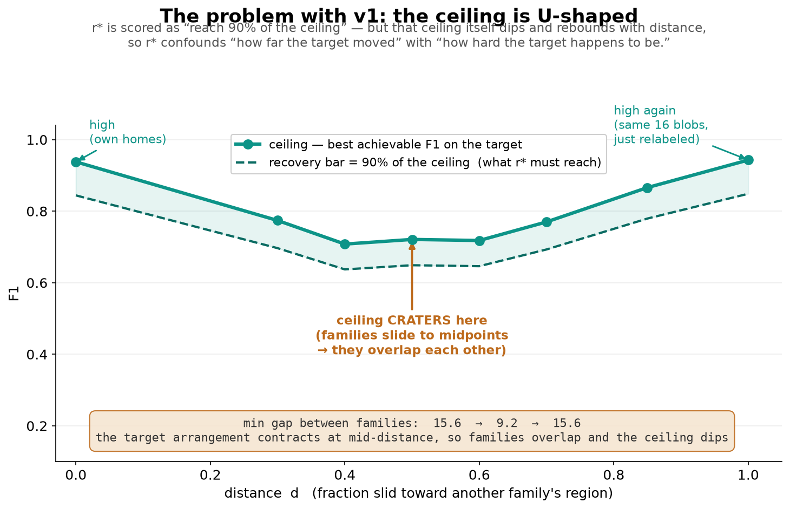
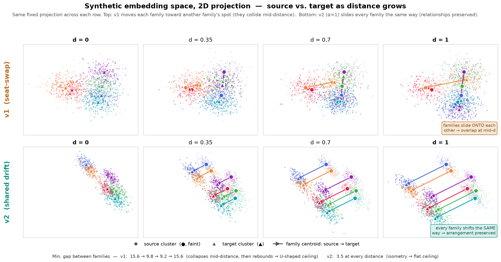
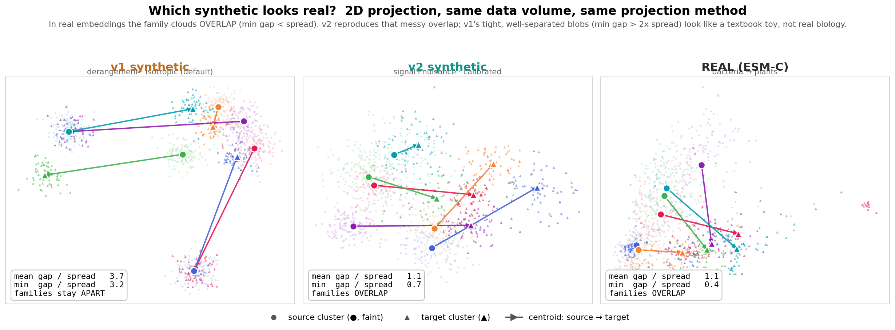
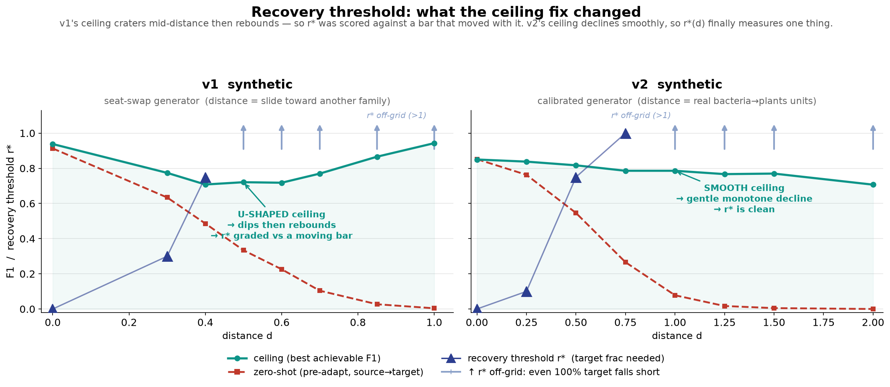
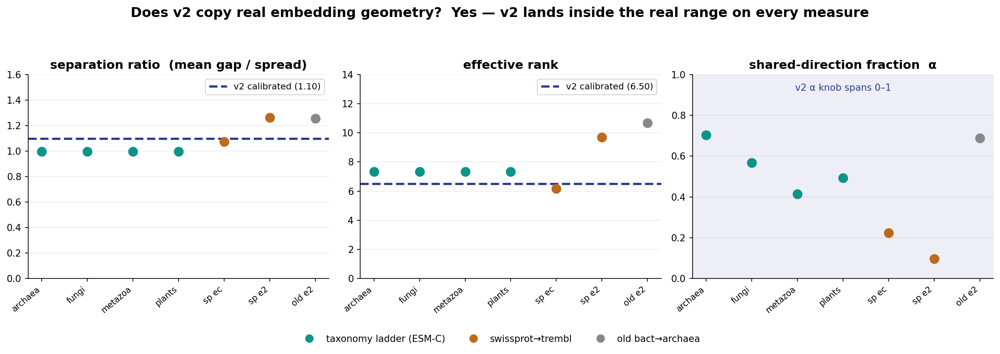
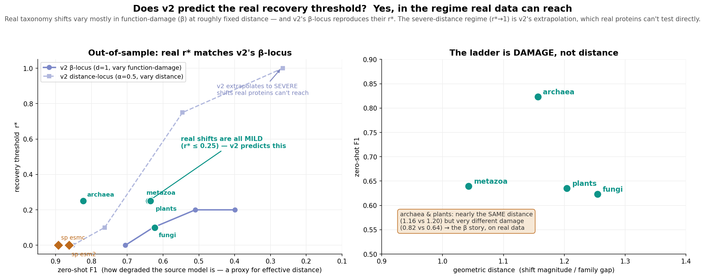

# July 22 — synthetic data rebuilt (v2), calibrated to real embeddings

Goal restated: the synthetic data must **mimic real PLM embeddings** so that
`recovery threshold r*(distance)` answers a real question — how many novel proteins a
scientist must sequence before a PLM works on a metagenome that sits some distance
outside known (human-biased) sequence space.

## 1. Diagnosed the U-shaped ceiling in v1 (it was a design artifact, not a bug)

- v1's target centroid was `M_f(d) = (1-d)C_f + d·C_π(f)` with π a **derangement** (a
  bijection). At d=1 the centroid *set* is the same 16 points permuted → isometric to
  source → same ceiling as d=0. At d≈0.5 every family sits at a midpoint and the whole
  configuration contracts by `√((1-d)²+d²)` → classes overlap → ceiling craters.
- Verified: Bayes accuracy computed from centroid geometry alone predicts the measured
  ceilings at **r = 0.993 (σ=4), 0.997 (σ=6)**.
- Consequence: distance and target task difficulty were confounded, and r* was scored
  against a **moving bar** (0.9·ceiling(d)) that dipped exactly where the ceiling dipped.

## 2. Measured what real embeddings actually look like

`src/measure_real_geometry.py`, over `somedir/`, `swissprot_esm2/`, `swissprot_esmc/`,
and the four `taxonomy_ladder/` rungs:

| quantity | real | v1 synthetic |
|---|---|---|
| mean family gap / within-family σ | 1.0–1.3 | 5.6 |
| effective rank | 3–11 of 960 | 32 |
| shift is a shared direction (cos) | +0.41 to +0.71 | ~0 |
| per-family σ spread | 1.8–2.0× | identical |
| family sizes | up to 36× skew | uniform |

Two killer facts:
1. An **isotropic** mixture at the real separation ratio (~1.0) caps at **0.18** accuracy,
   but real data hits 0.90 there → real embeddings are strongly **anisotropic**; v1 was
   only "realistic" by inflating separation 6×.
2. The real shift is largely a **shared translation** — families move together along a
   taxonomy axis, they do **not** swap identities (the opposite of the derangement).

Real performance anchors (ESM-C ladder, bacteria→X, zero-shot / ceiling):
archaea .848/.903, fungi .619/.833, metazoa .632/.888, plants .610/.839.
(The ~70% figure was the zero-shot for distant eukaryotes, **not** the ceiling.)

## 3. Built generator v2 — `src/generate_synthetic_v2.py`

- **Latent = signal subspace (dim 8) + nuisance subspace (dim 64, power-law spectrum).**
  Reproduces "gap ≈ σ yet F1 ≈ 0.90" and low effective rank at once.
- **Shift knobs, all anchored to measurable quantities:**
  - `d` — distance in units of the **real bacteria→plants shift** (d=1.0 = that rung; d>1
    extrapolates toward "novel Arctic metagenome" territory).
  - `alpha` — shared-direction fraction; `E[cos] = alpha` verified exactly. α=1 = pure
    covariate shift, α=0 = pure concept shift. Real cosine ~0.5.
  - `beta` — fraction of the **shared** translation in the signal (function) subspace.
  - `target_sigma_inflate` — the **only** knob that lowers the ceiling.

### The ceiling-invariance rule (cost 3 failed designs)

Any family-specific displacement must be an **exact isometry** of the centroid
configuration, or the ceiling drifts and r*(d) is confounded again:

| attempt | mechanism | failure |
|---|---|---|
| v1 | interpolate toward a derangement | configuration contracts → U-shape (21-pt swing) |
| v2a | independent random displacement/family | high-dim near-orthogonality inflates gaps → ceiling → 1.00 |
| v2b | interpolate toward a fresh centroid draw | preserves distribution not realisation → ceiling drifts .90→.95 |
| **v2c (kept)** | **rotate the configuration in the signal subspace** | **isometry at every angle → mean gap 10.15 / min gap 3.53 hold to all digits; Bayes ceiling .897–.901** |

Also: β must **not** be routed into the nuisance subspace for the family-specific term —
centroids have no nuisance component, so per-family nuisance moves make that subspace
label-informative and the ceiling jumps to 1.00. β applies to the shared translation only.
The ceiling is now moved by exactly one calibrated knob, `target_sigma_inflate` (0.15).

## 4. Calibrated the geometry — `src/calibrate_v2.py`

Fit to the real target box (separation ratio, min-gap ratio, effective rank, F1):
`signal_dim=8, nuisance_dim=64, centroid_spread=3.0, sigma_signal=1.5,
nuisance_ratio=3.0, spectrum_exponent=2.0, family_sigma_spread=1.9,
family_size_skew=36.0, d_unit_gaps=1.20` → sep=1.09, effective rank 6.3, ceiling ≈ 0.85.

## 5. Ran the sweep — job 47136848, `src/run_distance_sweep_v2.py` + `.slurm`

Three arms → `/scratch/lmk04992/synth_v2_{distance,alpha_sweep,beta_*}/`.
Plots via `src/plot_v2_results.py` (always draws ceiling(d) beside r*(d)).

**Ceiling fixed.** Distance arm (α=0.5): ceiling = .850 .838 .817 .786 .786 .767 .770 .707
for d=0→2 — mild monotone decline, no U-shape (v1 swung 21 pts; this is monotone). Roughly
flat across α apart from a small α=1 residual (at d=1: α=0 → .818 vs α=1 → .773) — an
optimisation artifact, not geometry; see Open Item 2.

**r*(d) survives and rises**, and the new headline is that r* depends on the **type** of
shift, not just the distance:

| α (shift type) | r* across d = 0 → 1 |
|---|---|
| 1.0 pure covariate | 0, 0, 0.3, 0.3, 0.2 |
| 0.7 | 0, 0.05, 0.75, 0.75, 1.0 |
| 0.5 | 0, 0.1, 0.75, 1.0, off-grid |
| 0.0 pure concept | 0, 0.2, 0.75, off-grid, off-grid |

A displaced-but-functionally-intact sample needs few novel proteins; a
function-reorganising one needs many. **Distance alone does not determine cost.**

**β fits the real rungs.** zero-shot at d=1: β=.05→.705, .15→.628, .30→.510, .50→.399.
So **β≈0.15 reproduces the eukaryote rungs** (.628 vs fungi .619 / metazoa .632 /
plants .610); archaea (.848) needs β≈0.02–0.05 → bacteria→archaea shift is nearly
orthogonal to function. Ceiling identical across all β → β is a pure damage knob.

## 6. Fixed an unrelated v1 crash

`generate_synthetic_precomputed.py` line ~176: `perm = rng.permutation(...)` shadowed the
derangement `perm`, crashing the standalone CLI/Nextflow path (IndexError) for any d>0 with
≥2 OOD fractions. Renamed to `shuf`. The sweep results were unaffected (the driver imports
`build_universe`/`sample` directly and never runs `__main__`).

## Open items for next session

1. **Re-measure α with a bootstrap / split-half correction.** The measured α=0.41–0.70 is
   likely inflated by centroid-estimation noise (18–649 proteins/family); the clean β fit at
   α=1 is circumstantial evidence the true α is nearer 0.9–1.0 with small β.
2. **Standardise MLP inputs with source-fit statistics.** A minor residual: at α=1 the
   ceiling declines a touch more than at α=0 despite identical Bayes error — an optimisation
   effect from the large mean input offset, not geometry. Does not affect r*(d).

## Figures

All four are in [`docs/figures/`](../figures/README.md), with regeneration commands.

**The bug.** v1's ceiling dips and rebounds with distance, so `r*` was graded against a
moving bar:

**The fix, in the embedding space.** v1 slides families onto one another and they collide
mid-distance; v2 slides them all the same way and the arrangement survives:

**Does it look like reality?** v1 vs v2 vs real ESM-C, same data volume, same projection:

**What the fix bought.** v2's ceiling declines smoothly, so `r*(d)` measures one thing:

**Validation.** v2's geometry against real, and its out-of-sample recovery prediction:

## Files

New: `src/{generate_synthetic_v2, run_distance_sweep_v2, calibrate_v2,
measure_real_geometry, plot_v2_results}.py`, `slurm/run_distance_sweep_v2.slurm`.
Modified: `src/generate_synthetic_precomputed.py` (crash fix).
Outputs: `/scratch/lmk04992/synth_v2_{distance,alpha_sweep,beta_0.05,beta_0.15,beta_0.30,beta_0.50}/`.
